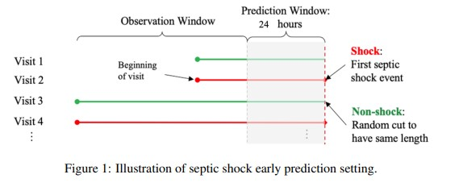
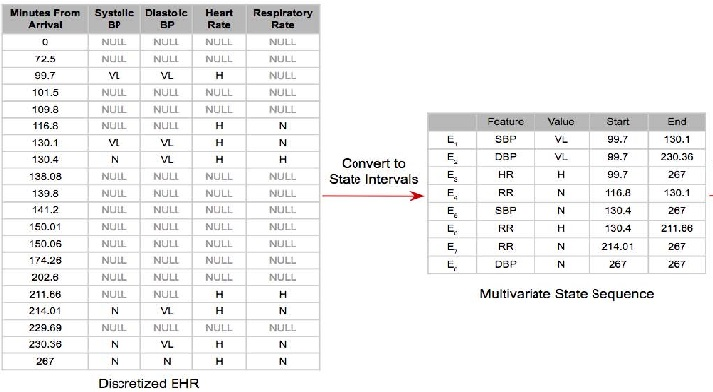

### Introduction

From the paper "Recent Temporal Pattern Mining for Septic Shock Early Prediction":

"Sepsis is the leading cause of mortality in the United States and the most expensive condition
associated with in-hospital stay, accounting for 6.2% (nearly $24 billion) of total hospital costs.
In particular, Septic shock, the most advanced complication of sepsis due to severe abnormalities
of circulation and/or cellular metabolism, reaches a mortality rate as high as 50% and the annual
incidence keeps rising. It is estimated that as many as 80% of sepsis deaths could be prevented
with early diagnosis and intervention; indeed prior studies have demonstrated that early diagnosis
and treatment of septic shock can significantly decrease patients’ mortality and shorten their length
of stay."[1]

In this project, I have built and compared two machine learning approaches to accurate early diagnosis
of septic shock from Electronic Health Records (EHR). The first approach is to use Recent Temporal Pattern Mining to extract temporal patterns from EHR to be fed into classifiers such as SVC and Logistic Regression. The second approach is to use LSTM neural networks with and without using preprocessing of the EHR to normalize time intervals between medical events. 

The aim is to be able to best forecast the probability that a hospital patient will
enter into shock in the next 24 hours, based on their present charts. This will enable the medical team to more closely monitor patients with high probabilities of spetic shock and consider preventive treatments.

### Multivariate State Sequence

One of the characteristics of EHR is that the time intervals between reords are not necessarily even. In addition, different tracked values such as vitals are not recorded at each time step. For conventional time sequence modelling, such as RNN or LSTM, the assumption is that time steps are at regular intervals, such as 30 minutes. An approach to preprocess such records is to convert them to a multivariate state sequence (MSS), abstracting the durations of different readings over time.

### Recent Temporal Patterns

From the MSS one can discern various frequent temporal patterns, such as a drop in temperature often drops during or after a drop in blood pressure. These patterns are then the features to be input to a classifier such as SVC. 

### "Naive" LSTM vs. Reconstructed Time Sequences

The "naive" approach takes the original EHR with time intervals as they are, with irregular intervals. Normally, for LSTM time sequence modelling, one assumes regular time intervals (such as every half hour). The other approach is to reconstruct the time intervals to a regular period of every 10 minutes. To do so I frist constructed a MSS, as above, and then created time intervals of 10 minutes for all patients.

### References

This project was a capstone for the NC State University's AI Academy certification program in Artificial Intelligence.

[1] Farzaneh Khoshnevisan, Julie Ivy, Muge Capan, Ryan Arnold, Jeanne M. Huddleston, and Min Chi, [Recent Temporal Pattern Mining for Septic Shock Early Prediction](https://www.researchgate.net/profile/Farzaneh-Khoshnevisan/publication/325273093_Recent_Temporal_Pattern_Mining_for_Septic_Shock_Early_Prediction/links/5b172e5345851547bba33cd1/Recent-Temporal-Pattern-Mining-for-Septic-Shock-Early-Prediction.pdf)

### Top level notebooks:

**split_data.ipynb**: Run once to split data sets into training and test sets. Same splits used in all tests to maintain consistency.

#### RTP

**RTP_experiments.ipynb**: 5 fold cross validation for different parameters/hyperparameters with SVM and Logistic Regression classifiers.

**RTP_evaluate.ipynb**: testing best parameters with SVM and Logisitic Regression agains held out test data.

#### LSTM

**naive_LSTM.ipynb**: No awareness of differing elapsed times between test steps. Vanilla LSTM.

**naive_BiLSTM.ipynb**: Same except with bidirectional LSTM

**time_reconstructed_LSTM.ipynb**: Timelines reconstructed to even 30 minute intervals using Multivariant State Sequences (same preprocessing as for RTP mining). Values are discretized into bins (e.g., VL, L, N, H, VH, by quantiles). Vanilla LSTM.

**time_reconstructed_noencode__LSTM.ipynb**: Same, but without discretization.

**time_reconstructed_BiLSTM.ipynb**: Same, except with bidirectional LSTM. With discretization.

**time_reconstructed_noencode_BiLSTM.ipynb**: Same, but without discretization.

result set	accuracy	precision	recall	f1	auc
1	naive_results	0.891892	0.837209	0.972973	0.900000	0.891892
0	bi_results	0.878378	0.833333	0.945946	0.886076	0.878378
3	tr_noencode_bi_results	0.864865	0.846154	0.891892	0.868421	0.864865
4	tr_noencode_results	0.837838	0.857143	0.810811	0.833333	0.837838
5	tr_results	0.729730	0.717949	0.756757	0.736842	0.729730
2	tr_bi_lstm_results	0.554054	0.529412	0.972973	0.685714	0.554054
